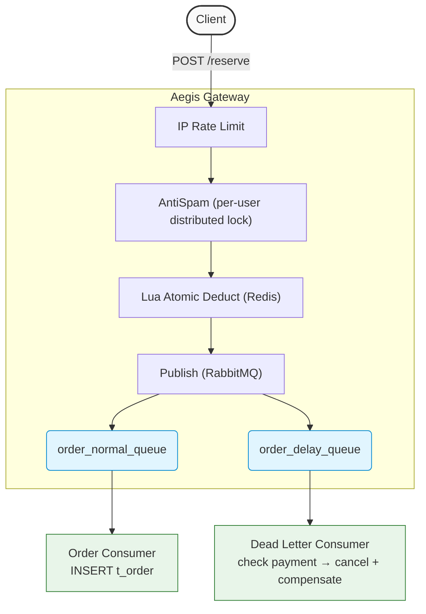
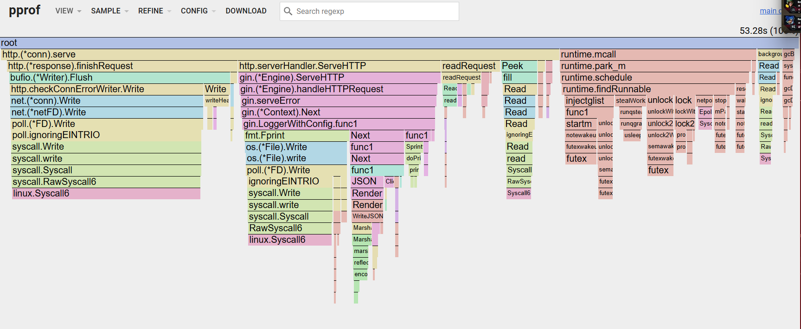
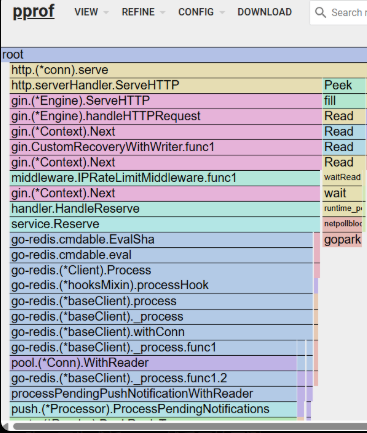
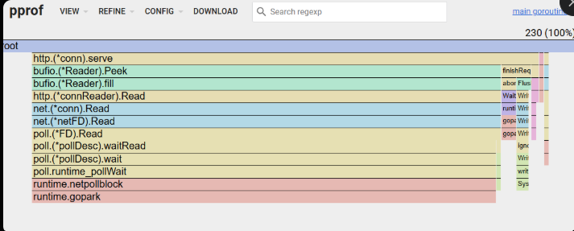

# Aegis Gateway

[English](README.md) | [简体中文](README.zh.md)

> High-concurrency scarce-resource reservation system: Redis Lua + RabbitMQ dead letter queue + **reliable-message eventual consistency**. 50K QPS on a single host.

[]()
[]()
[]()

---

## Background

Solves the classic scarce-resource flash-sale problem (vaccine appointments, limited drops, ticketing): preventing overselling, blocking duplicate submissions per user, and automatically cancelling unpaid orders after a timeout.

---

## Architecture



---

## Core Tech

### 1. Anti-Oversell: Redis Lua Atomic Deduction

- A single Lua script atomically executes `GET` / `SISMEMBER` / `DECR` / `SADD` on Redis's single-threaded core
- Verified under load: 200 concurrent requests against 1 unit of stock — **exactly 1 success**
- The script is uploaded once at startup via `ScriptLoad`; requests reuse the 40-byte SHA1 with `EvalSha` to cut network payload

### 2. Anti-Duplicate: Per-User Distributed Lock (5s TTL + Watchdog renewal)

- UUID + SETNX for ownership-tagged acquisition
- A `Watchdog` goroutine renews the TTL every `TTL/3` via a Lua `check-and-PEXPIRE`
- `Unlock` uses a Lua `check-and-DEL` so a slow process can never erase another holder's lock

### 3. Reliable-Message Eventual Consistency: RabbitMQ Dual-Queue + Dead Letter Compensation

> Distinct from TCC / Saga patterns. This is the canonical "reliable message" approach: a message is durably persisted in RabbitMQ, and the dead-letter consumer guarantees the system will eventually reconcile DB and Redis state even if individual steps fail or restart.

- On successful reserve, the message is fan-published to both `order_normal_queue` (immediate `INSERT t_order`) and `order_delay_queue` (15-min TTL)
- When the delay queue's TTL fires, the message dead-letters to `order_dead_queue` → consumer queries payment status → if still unpaid, marks the order cancelled and triggers Redis compensation
- `compensate.lua` is idempotent via a `SISMEMBER` guard — safe under redelivery or partial failures

### 4. Retry Mechanism: Dedicated Delay Queues + Header Counter

- On transient DB failure, the consumer republishes the message into a retry queue (1-min TTL) that automatically loops back to the origin
- `Headers["x-retry-count"]` is incremented each round; after 3 attempts the message is logged for manual intervention and physically removed
- The normal-queue and dead-letter consumers have **separate** retry queues to prevent cross-contamination

---

## Performance

### Test Environment
WSL2 (Ubuntu) + Redis/MySQL/RabbitMQ Docker single-machine deployment. 
`ulimit -n 65535`, Redis not persisted (AOF off), RabbitMQ delivery_mode=2 (persistent messages).
8 threads / 200 connections / 30-second load test 

### Group A: HTTP Layer Ceiling (no Lua / Redis hit)

| Stage | Optimization | QPS | Avg Latency |
|-------|--------------|-----|-------------|
| Baseline | `gin.Default()` + debug mode | 25,130 | 75 ms |
| Strip access log | `gin.SetMode(Release)` + `gin.New()` + Recovery | **429,586** | **844 µs** |

> In this group requests are rejected by upstream middleware via the fast path; the number reflects raw HTTP framework throughput.

### Group B: End-to-End Business Throughput (full Redis Lua path)

| Metric | Value |
|--------|-------|
| QPS | **50,365** |
| Avg Latency | 4.23 ms |
| Latency stddev | 5.45 ms |
| Bottleneck | go-redis `EvalSha` network RTT (flame-graph evidence) |

> This group exercises the full `Reserve → EvalSha → Lua` chain. Of the 4.23 ms average latency, roughly 4 ms is Redis network round-trip.

---

## Flame Graph Analysis

### Figure 1: Baseline



Before optimization: `gin.LoggerWithConfig` → `fmt.Fprint` → `syscall.Write` dominates CPU. The hidden cost is one stderr `write(2)` per request.

---

### Figure 2: Optimized



After optimization: the business chain `service.Reserve` → `go-redis.EvalSha` → `runtime.netpoll` is clearly visible. The bottleneck has shifted entirely to Redis network I/O with no remaining business-code hotspots.

---

### Figure 3: System Health



The goroutine profile shows all 390 goroutines healthy under 200 concurrency — blocked only on HTTP read and Redis I/O. No mutex contention, no GC pauses, no I/O backlog.

---

## Data Schema

The MySQL side stores only the order record. Redis owns the hot path (stock counter + buyer set).

```sql
CREATE TABLE t_order (
    order_no    VARCHAR(64)  PRIMARY KEY COMMENT 'UUID v4 with ORD- prefix',
    user_id     VARCHAR(32)  NOT NULL,
    resource_id BIGINT       NOT NULL,
    status      TINYINT      NOT NULL DEFAULT 0
                COMMENT '0=pending  1=paid  2=cancelled',
    created_at  DATETIME     DEFAULT CURRENT_TIMESTAMP,
    updated_at  DATETIME     DEFAULT CURRENT_TIMESTAMP
                                       ON UPDATE CURRENT_TIMESTAMP,
    UNIQUE KEY  uk_user_resource (user_id, resource_id)
) ENGINE = InnoDB DEFAULT CHARSET = utf8mb4;
```

**Design trade-offs:**

- **PK = VARCHAR(order_no)**: UUID is distributed-friendly (no coordinator), but random inserts cause B+Tree page splits. Acceptable here; switch to Snowflake if write throughput becomes the bottleneck.
- **`UNIQUE KEY` on `(user_id, resource_id)`** — *defense in depth*: Redis `SISMEMBER` is the first line of defense (O(1), fast path). But Redis can lose in-memory state on restart or failover, so MySQL's UNIQUE constraint serves as the **last-resort backstop** — even if Redis is compromised, duplicate orders are still rejected at the DB layer.
- **`DATETIME` instead of `TIMESTAMP`**: TIMESTAMP overflows at 2038-01-19 (32-bit). DATETIME covers up to year 9999 at a 3-byte overhead — trivial compared to the data and indexes.

Full schema in [`scripts/init.sql`](scripts/init.sql).

---

## Project Structure

```text
aegis-gateway/
├── cmd/
│   └── api/
│       └── main.go                      # Entry point: initializes components and starts the HTTP server
├── internal/
│   ├── api/
│   │   ├── handler/
│   │   │   └── reserve.go               # Request parsing, validation, dispatch to service
│   │   └── middleware/
│   │       ├── ratelimit.go             # IP token-bucket rate limit (golang.org/x/time/rate)
│   │       └── anti_spam.go             # Per-user distributed lock anti-duplicate
│   ├── bootstrap/
│   │   ├── db.go                        # MySQL connection pool init
│   │   ├── redis.go                     # Redis init + Lua script preload (ScriptLoad)
│   │   ├── rabbitmq.go                  # Declares exchange, queues, bindings
│   │   └── router.go                    # Gin router setup; reads APP_MODE to toggle rate limits
│   ├── consumer/
│   │   ├── order_consumer.go            # Normal order consumer: listens on order_normal_queue, calls InsertOrder
│   │   ├── dead_letter_consumer.go      # Dead letter consumer: unpaid timeout → cancel order + compensate Redis
│   │   └── helper.go                    # Shared utilities: getRetryCount (safe AMQP header type assertion)
│   ├── global/
│   │   └── global.go                    # Global singletons (DB, Redis, ReserveSHA, CompensateSHA, MQChannel)
│   ├── repository/
│   │   ├── mysql_repo.go                # InsertOrder / GetOrderByUserAndResource / UpdateOrderStatus
│   │   └── redis_repo.go                # Redis ops wrappers
│   └── service/
│       ├── reserve_service.go           # Core business: EvalSha Lua + dual MQ publish
│       └── reserve_service_test.go      # Concurrency test: 200 goroutines fight for 1 stock unit
├── pkg/
│   └── distributed_lock/
│       ├── lock.go                      # Distributed lock: SETNX+TTL, Lua atomic unlock, watchdog renewal
│       └── lock_test.go                 # Lock unit tests
├── scripts/
│   ├── lua/
│   │   ├── reserve.lua                  # Atomic stock deduct: stock check → SISMEMBER → DECR + SADD
│   │   └── compensate.lua               # Idempotent compensation: SISMEMBER guard → INCR + SREM
│   ├── wrk.sh                           # Generates wrk load-test Lua script at /tmp/reserve.lua
│   └── test_day3.sh                     # Day 3 smoke test script
├── go.mod
├── go.sum
├── docker-compose.yml                   # One-shot setup: MySQL(3309) + Redis + RabbitMQ
└── LICENSE
```

---

## Quick Start

```bash
# 1. Start dependencies
docker compose up -d
```

```bash
# 2. Create schema
docker exec -it appoint_mysql mysql -uroot -p0410 appoint_db < scripts/init.sql
```

```bash
# 3. Start the service
go run cmd/api/main.go
```

```bash
# 4. Load test
APP_MODE=loadtest go run cmd/api/main.go    # disables anti-spam middleware
bash scripts/wrk.sh
wrk -t8 -c200 -d30s -s /tmp/reserve.lua http://localhost:8080/api/v1/reserve
```

---

## Roadmap

- [x] Graceful shutdown (SIGTERM waits for in-flight consumer work)
- [ ] Cloud deployment (Docker Compose on VPS, publicly accessible)
- [ ] Redis pipeline batching (expected +50% QPS)
- [ ] Local in-memory pre-deduction + async Redis sync (expected 5-10x)
- [ ] Dead letter table persistence (audit trail for operations)

---

## Tech Stack

Go 1.26 / Gin / go-redis v9 / amqp091-go / Lua / Docker Compose
